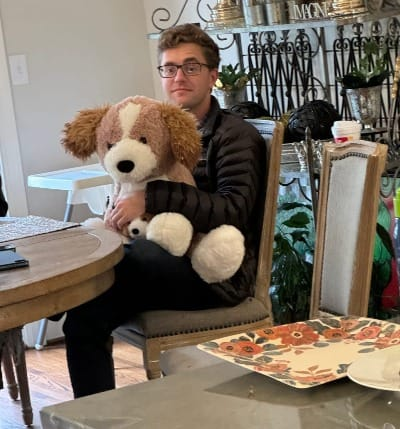

Howdy! I'm Reese. At the end of 2024, I left my full-time job to wander around the world, and I've been dedicating much of that newfound free time to writing about my interests: [travel](/tags/travelogues/), [meditation](/essays/being-a-grown-up/), navigating a [quarter-life crisis](essays/field-notes-from-a-quarter-life-crisis/), and [books](tags/reviews/) of all kinds.

On the [professional](https://www.linkedin.com/in/reese-w/) front, I've worn many different hats, mostly recently as a software engineer at [Stripe](https://stripe.com). I've also worked as a professional classical musician and served on the Board of Directors for an [arts nonprofit](https://theintersection.org/).

Questions? Complaints? Exclamations of mirth and merriment? Feel free to reach out to me: me@reesew.com
