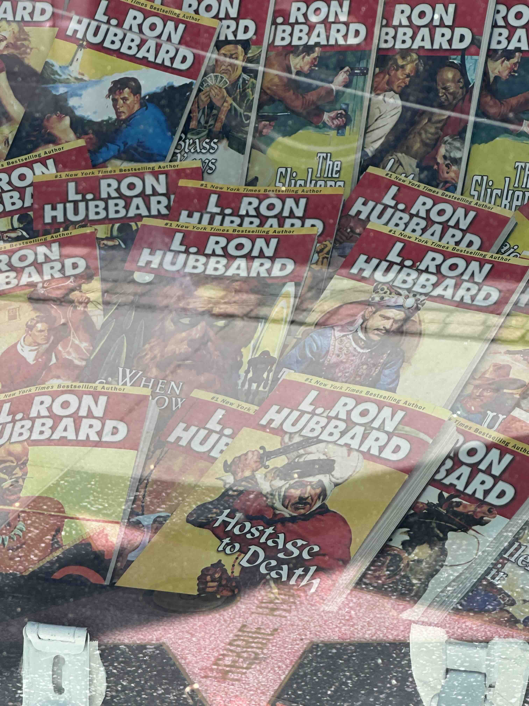

Greetings, my dearests, from the beautiful Sequoia National Park! Couldn't ask for a better place to inaugurate this auspicious day: a newsletter is born.

I'll keep this first one brief -- I'm shooting for these to be bi-weekly, and in them will be updates on what I'm up to -- mostly all the bits and pieces that haven't explicitly made it into the [travelogues](http://reesew.com/tags/travelogues/), of which there are many -- and also whatever writing I've been doing in the meantime. Also possibly just some Cool Stuff that I think is worth sharing, like other folks' writing, music, film, and so on. And if you've got some cool stuff to share, [send it my way](mailto:me@reesew.com)! This'll all be way more casual than the writing than I usually do, and everybody gets enough email as it is, so I'll try my best to make it worth your while and to keep things brief-ish.

This is mostly just another way for me to pull my personal updates off of Instagram. I started using IG to keep everyone posted on what I'm up to day-to-day -- and to be clear, I'll still be doing so for now -- but I simply don't like using it. Photos are great, but they are really not the right medium to convey what I'm up to, although I'm sure everyone appreciates the nice nature photos and all that. But pretty nature photos aren't really the point, in the end, so I thought it'd be fun to experiment with alternatives.

---

This past week has been a busy one. I took a bit of a detour from my National Parks route and stopped by Los Angeles, primarily so I could swing by an event for the release of Craig Mod's newest book _Things Become Other Things_ (it's excellent! read it!), which I [reviewed](https://reesew.com/book-reviews/things-become-other-things/) (and still want to read for a second time, and probably then a third).

Despite living in California for several years, I had never been to LA. I spent maybe a week or so in the nearby San Bernadino Mountains, but LA itself never drew me in. San Francisco is comparatively compact -- only 7 miles long and 7 miles wide, small enough to walk end-to-end in a day -- and only by the time I left did I feel like I had a foothold there. In contrast, Los Angeles is a behemoth: the highways are sprawling, and it could probably more appropriately be described as 10 cities in a trenchcoat. I found getting anywhere to take at least an hour due to seemingly perennial traffic. (That almost always makes me hard pass on a city -- it needs to be at least kinda-walkable, have excellent public transit, or ideally both.) It's also perhaps due to me picking the cheapest accomodations possible and thus staying in Hollywood, but the constant presence of Scientology -- I saw the Scientology center, the _celebrity_ center in Los Feliz, the L. Ron Hubbard memorial building, and about a thousand advertisements in my few days there -- gave me the ick.

But there were absolutely some bright spots. The Getty is an incredible museum, not only for its unreasonably good collection but also for its service as a small oasis for when I was sufficiently road-raged and needed a break. I wasn't expecting to go there and be amazed by a bunch of Renaissance art, but I absolutely was. There was also a small celebration for Craig's book release at Firstborn, a newer restaurant in Chinatown with a killer tasting menu.

---

But I was ready to get back into a nature after a week in the city, and man, Sequoia is _incredible_ right now. The snowmelt has the waters running _hard_, and my campsite is right next to one of the park's many rivers, so I've got my own natural white-noise machine to thank for my much-needed mid-day naps.

And since the park is so high up, the weather is perfect. I've been constantly driving through the scorching desert and feeling like the sun would turn me into leather for these last few weeks, so the cool alpine air, the nice 70 degree days, the giant-eared deer that graze in the campsite -- these make me happy.

---

### Recommendations

- [Looking for Alice](https://www.henrikkarlsson.xyz/p/looking-for-alice) -- I've found myself brought back to Henrik Karlsson's blog _Escaping Flatland_ lately, and so much of his writing is wonderful, but "Looking for Alice" remains one his best works. “I knew I had to say those exact words. Because _I know the heart of men_.”
- Joan Didion's "The White Album" (both the essay itself and the [essay collection](https://bookshop.org/a/97650/9780374532079) of the same name) is so far fantastic. Didion has this unnatural ability to pick just a few words from someone and have it unravel their entire soul on the page
- Pinegrove's last (for now? ever?) release [_Montclair (Live at the Wellmont Theater)_](https://pinegrove.bandcamp.com/album/montclair-live-at-the-wellmont-theater) made its way back on my playlist this week. Highly recommended for blasting at top volume while blaring down the highway

---

With that, I'll let you get back to it. Thanks as always for reading. Drink water, sit up straight, give someone a hug, all those good things. Catch you soon.

Love,

-R
