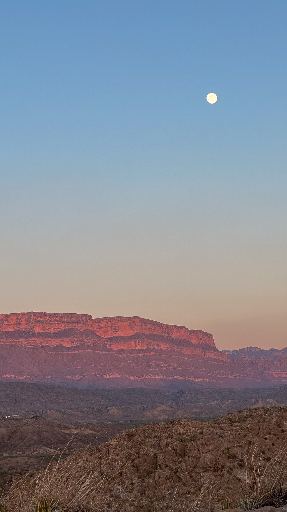
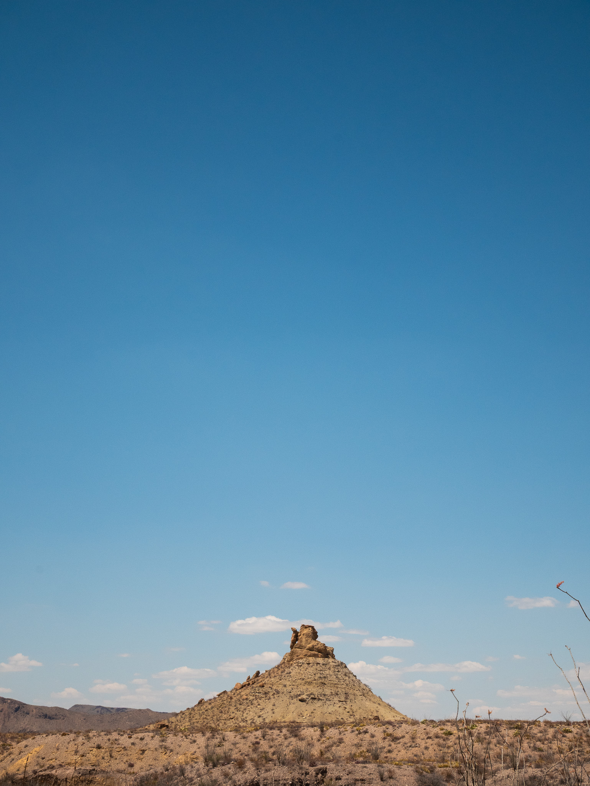
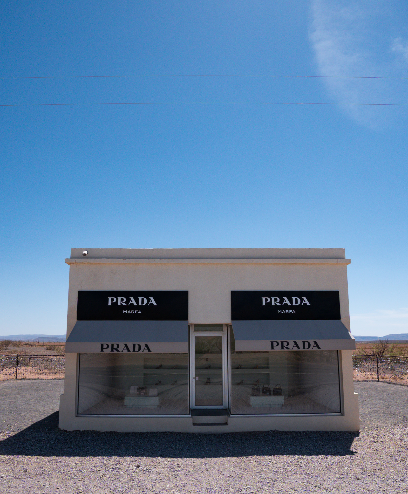
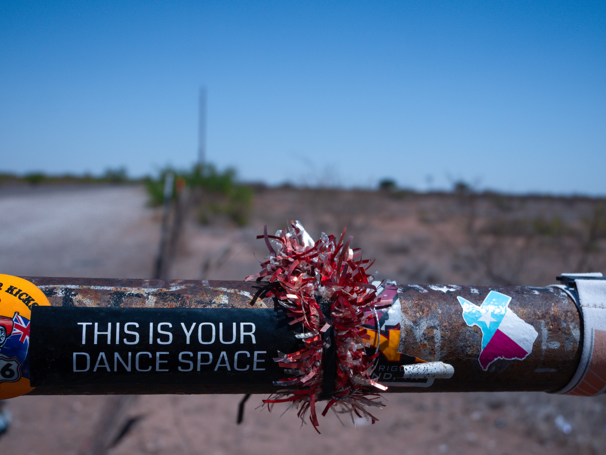

+++
title = 'Wandering America: All Hail West Texas'
date = 2025-05-12T09:38:01-06:00
description = 'Deserts, Prada stores, survival instincts'
featureImage = "rio-grande-sunset.jpg"
slug = 'wandering-america-all-hail-west-texas'
tags = ['travelogues', 'Wandering America']
draft = true
+++

I saw a light flash up at me, picking me out of the midnight desert landscape. “Looks like we’ve got a problem,” the voice behind the light said.

Out in the desert, the mind is pulled, over and over again, back to its survival instincts. I was near the campground and dozens of visitors with food and supplies, and yet a small part of my brain was continuously calculating how much water I had, when I needed to eat, listening for new sounds: a background task that slowly syphons away my mental battery.

The voices slowly made their way up to the overlook. A group of college guys from the campsite — I had seen them earlier across the road, cooking on a charcoal stove and shouting some friendly bullying and having drawn-out arguments about a mutual friend. They didn’t seem to be aware that in the quiet of the desert night, their voices could carry for miles, the only competition being the soft susurration of long grass and the Rio Grande’s gentle whisper.

They were friendly, of course, but on their ascent my Survival Background Task was still churning. Perhaps it’s because my only mental model of desert survival is almost entirely cribbed from _Breaking Bad_ and _Blood Meridian_, but all my mind had to offer was a violent tension, the ever-present possibility of resorting to whatever means necessary for self-preservation.

The group made it to the top of the overlook and we exchanged quiet nods, settling in to watch the stars overhead.

---

The sky above Big Bend National Park was divided into two: one half all stars slowly arising from the darkness, the other half dominated by a glaring full moon. For all those strange swirling emotions, my conscious mind instead kept returning to one of my all-time favorite passages from another Cormac McCarthy novel, _All the Pretty Horses_:

> They rode out along the fenceline and across the open pasture-land. The leather creaked in the morning cold. They pushed the horses into a lope. The lights fell away behind them. They rode out on the high prairie where they slowed the horses to a walk and the stars swarmed around them out of the blackness. They heard somewhere in that tenantless night a bell that tolled and ceased where no bell was and they rode out on the round dais of the earth which alone was dark and no light to it and which carried their figures and bore them up into the swarming stars so that they rode not under but among them and they rode at once jaunty and circumspect, like thieves newly loosed in that dark electric, like young thieves in a glowing orchard, loosely jacketed against the cold and ten thousand worlds for the choosing.

_They rode not under but among them_. This was what I felt up on the outlook, high above the desert plains below, floating.

When I was a kid, I was obsessed with space. I had memorized astronaut names and mission crews, distances between galaxies. I spent my free time flipping through this book called _Earth and Space_, which despite being for kids still taught me all about galaxy clusters and theories behind wormholes.

The surest way I know to have an out-of-body experience is to sit out under the stars. I sit there and just consider where those stars are, how far away they might be. How long would it take me to walk there? What exists in all that vastness? I think about the 93 million miles it would take to get to the sun, and then the 25.2 trillion miles to Proxima Centauri, our nearest neighbor star. Numbers so large as to feel meaningless. I lay on my back and think about the hours and hours it’s taken me to drive the thousand miles between Birmingham and Big Bend, and to do that 93,000 times just to get to the sun, and then to do _that_ about 270,000 times, traversing through empty space. In the time it would take to get that far even with our fastest spaceships, individual lives are just a blip, whole civilizations rising and falling, any conception we may have of our collective future just a footnote on the annals of Earth’s history.

And all of that distance is just space, void, stories playing out on scales beyond comprehension. I feel small, but not in a way that causes any sense of anxiety or dread. I have my role in this cosmic drama. From that perspective I view the whole cosmos playing out in front of me, my tiny perspective so hilariously focused on paying the bills and planning for imagined circumstances while the whole time galaxies are colliding, stars being born and dying, my sense of what’s possible impossibly small by comparison.

---

The desert has a vastness of its own, incomparable to space but still so large as to feel strange on a human scale. Driving out of Big Bend, I go for hours, blazing at 90mph[^mph] on the wide-open highway, not another soul in sight. The deserts of the American Southwest are probably the only place I’ve ever visited where I’m absolutely certain a person could disappear and never be found. I could park my car on the side of the highway and start walking, gone in the sands.

And in all of that vast space is pure strangeness. Something about the desert — the solitude, the endless beige, the Survival Background Task — stirs up the mind to strange ideas. This is most evident by what’s been left behind in the abandoned buildings, dilapidated RVs, and empty stores that seem to outnumber actual populated buildings in West Texas. The desert is a burial ground of towns that once may have thrived but now remain little more than caved-in roofs and piles of rubble surrounding a single still-standing tire shop. What remains is always fascinating, their stories likely long-lost: the Art Deco storefront whose only remaining signage was a hand-painted Walmart logo, dozens of cactus farms hundreds of miles from any possible customers, the recreation of a Prada store[^prada] — real Prada bags included! — on the highway roadside. You see a sign here and there for towns with names like [Truth or Consequences](https://en.wikipedia.org/wiki/Truth_or_Consequences,_New_Mexico) and wonder if you’ve lost your mind.

I can see these mechanisms first hand. Even on a long drive in the comfort of my car, I can sense the fine line between beauty and confusion playing out. Outside the dry air sucks the moisture right off your tongue. Sweat evaporates so quickly as to be almost unnoticed. No shade, no protection from the harsh sun. The body’s resources deplete in secret. One begins to see why the Desert Fathers secluded themselves in a place like that: it is the ultimate form of asceticism, not merely away from society but in a place hostile to your survival.

---

But the desert’s hostility is what makes it a wonder. It is unlike anywhere else with its quiet, its expansiveness, its inhabitants’ quiet determination towards life. It is a place that succeeds in spite of itself.

I believe I’ve finished my greatest bouts of desert driving, at least for a little while. I’m now in El Paso, and the nearby cities are much shorter drives than the long hauls taking me through the expanse of West Texas. Next up is some quick trips through White Sands, Guadalupe Mountains, and Carlsbad Caverns, all just an hour or two away from each other.

[^mph]: Having a healthy 80mph speed limit on an empty highway is a blessing. Anything slower would be maddening, the speed the only consolation for driving hundreds of miles in essentially a single straight line.

[^prada]: The story of the Prada store is, in fact, _not_ long-lost: it was an [art installation](https://en.wikipedia.org/wiki/Prada_Marfa) erected in 2005. I pulled the fastest U-turn I’ve ever done as soon as I saw this place.
