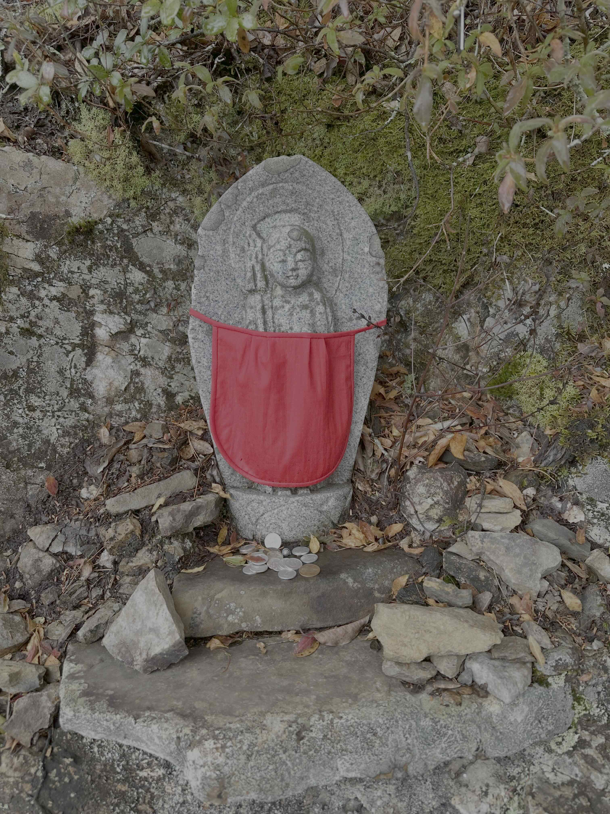

+++
title = 'Wandering America'
date = 2025-05-05
description = ''
slug = 'wandering-america'
type = 'travelogue'
+++

I’m on the road again — this time exploring these great United States, and particularly the National Parks.

I have a natural inclination to wander. It’s great to spend a lot of time in a single place, to get to know its rhythms and routines, but I always feel a little spark in my chest when I get back on the move. This morning I started off down the highway, and about twenty minutes in I looked out at the tall grass along the roadside, bending in rolling waves against the wind. My body relaxed, my vision opened up to the whole landscape. Everything was right where it should be.

---

In a foreign country, I’m a stranger in a strange land, helpless. Like a child: unable to speak the language or navigate your new environment alone, forced to depend on the kind help of others. Everything is novel, and it’s easy to just revel in that newness. Going back home is the complete opposite. It’s familiar, and finding your way back into that newness requires effort to look beyond the grooves of daily life. I fall back into old habits, old selves.

This trip is an attempt at melding the two together, at refreshing my perception of my home country with that sense of newness. America is huge, and my current sense of it is largely confined to the 1% of the country that I’ve seen and experienced. I’ve probably seen more parts of other countries than I’ve seen of my own.

---



someone will remember us

i say

even in another time



An accident caused the highway just outside of Little Rock to come to a standstill, so I took a detour. These back roads twisted between farmhouses and wheat silos, cutting through fields that stretched all the way to the horizon. Around a turn, I saw a tall cross nestled in the bushes. It tilted off to the side of the road, standing about five feet tall and completely coated with rust. It looked like one of those memorials erected in the memory of someone lost in some terrible accident. On top sat a John Deere baseball cap.

In Japan, I often saw tiny shrines or statues of [Jizo](https://en.wikipedia.org/wiki/K%E1%B9%A3itigarbha) at temples and along the road. Oftentimes these are donated by families in remembrance of children who passed away at an early age. People sew little red bibs and caps to put on the statues, to keep them warm as they watch over all the souls traversing samsara, the cycle of birth and death, and offer assistance to us in our struggle. Sometimes I found little Jizos in the most unexpected places, on mountaintops and in the crooks of trees, hands clasped, always smiling.

As I drove by the cross, this memory flashed into my mind. I imagined someone coming from abroad and seeing how we memorialize those who were taken too early. Perhaps they would feel that same mix of familiarity and newness, the same emotion finding a different manifestation in each place. We share the feeling of someone watching over us, remembering us when we’re gone.

---

 What is that feeling when you're driving away from people and they recede on the plain till you see their specks dispersing? - it's the too-huge world vaulting us, and it's good-bye. But we lean forward to the next crazy venture beneath the skies. 

So the road will be home for the next few months. I’ll try my best to keep things updated here as I go from place to place, at least with some photos. See you then.
